# Laranode - Open-Source Hosting Control Panel

Laranode is a simple but powerful open-source alternative to cPanel and Plesk, designed to simplify VPS and dedicated server management. With an intuitive interface and robust features, Laranode makes it easy to deploy and manage websites, databases, SSL certificates, and more.

**[Features](#features)** · **[Install](#installation)** · **[Docker](docs/DOCKER.md)** · **[Backups](#backup-and-restore)** · **[Upgrading](#upgrading)** · **[Screenshots](#screenshots)**

---

## Features

✅ **Self-Hosted** – Full control over your server with NO licensing fees.

✅ **Multi-Account Support** – Role-based access control for admins and users.  

✅ **Website Management** – Easily create and manage multiple websites.  

✅ **SSL with Let's Encrypt** – Secure your websites with free SSL certificates with a click of a button.

✅ **File Manager** – Built-in (from the ground up) web-based file manager for quick access.  

✅ **Live System Stats** – Monitor CPU, memory, and network usage in real-time. 

✅ **LAMP Stack Administration** – Manage Apache, MySQL, and PHP with ease.  

✅ **PHP Manager** – Install, enable and remove PHP versions (7.4 up to 8.5) and assign them per website.

✅ **User-Friendly Interface** – Clean and simple UI designed for efficiency.  

✅ **MySQL Database Management** – Create and control MySQL databases.  

✅ **UFW Firewall** – Manage uncomplicated firewall rules with ease directly from the web interface.  

✅ **Backup Manager** – Back up and restore accounts, website files, and databases locally, over S3, or over SFTP, on demand or on a retention schedule.

## Installation

Laranode can be installed on a FRESH VPS or dedicated server.

### Min. Requirements
- Ubuntu 24.04+
- 1vCPU
- 2GB RAM
- 10GB Disk Space

### Quick Install
```bash
curl -sSL https://raw.githubusercontent.com/crivion/laranode/refs/heads/main/laranode-scripts/bin/laranode-installer.sh | bash
```

### Docker
Laranode also runs as a single Docker container that boots systemd and hosts Apache, MySQL, PHP-FPM, the queue worker and reverb inside it, the same way the installer sets up a VPS.

```bash
git clone https://github.com/crivion/laranode.git && cd laranode
docker compose up -d --build
docker compose exec laranode laranode-artisan laranode:create-admin
```

📖 **[Running Laranode in Docker](docs/DOCKER.md)** covers the settings, the volumes and how upgrades work.

## Backup and Restore

Laranode can create and restore three kinds of backup:

- A complete hosting account, including all website files and databases.
- The files for one website.
- One website database.

Backups can be stored locally, in any S3-compatible object store (including DigitalOcean Spaces), or on an SFTP server. Administrators manage and test destinations from **Backup Destinations**, while account owners can back up and restore their own resources.

Run backups manually or schedule them daily, weekly or monthly. Each schedule has its own retention count, and expired archives are pruned automatically by the scheduler. Backup and restore jobs run asynchronously, with live status and failure details in the panel.

Restores require typed confirmation and create a seven-day safety snapshot before changing live data. A failed restore can be retried up to three times; completed backups otherwise remain available for future restores.

Local archives use this layout:

```text
/var/lib/laranode/backups/{system_username}/{backup_id}/
├── manifest.json
├── account.tar.gz
├── files/{domain}.tar.gz
└── databases/{database}.sql.gz
```

The root path can be changed with `LARANODE_BACKUP_PATH`. Docker installations persist local archives in the dedicated `laranode-backups` volume.

## Upgrading

Existing installations are upgraded with:

```bash
curl -sSL https://raw.githubusercontent.com/crivion/laranode/refs/heads/main/laranode-scripts/bin/laranode-upgrade.sh | bash
```

It pulls the latest release, updates dependencies, runs migrations, rebuilds the assets and re-applies the system configuration the panel needs (sudoers rules and the PHP-FPM systemd sandbox). Every step is safe to run repeatedly. Pass `PANEL_PATH=/path/to/panel` if Laranode is not installed in `/home/laranode_ln/panel`.

Docker installations upgrade by rebuilding the image instead, which applies the same steps on boot:

```bash
git pull && docker compose up -d --build
```

## Getting Started
Once installed, access Laranode via your browser:
```
http://your-server-ip
OR if you pointed your domain/subdomain
http://your-domain.tld
```
Login with the credentials provided during installation.

## Screenshots

| Light | Dark |
|:------:|:----:|
| 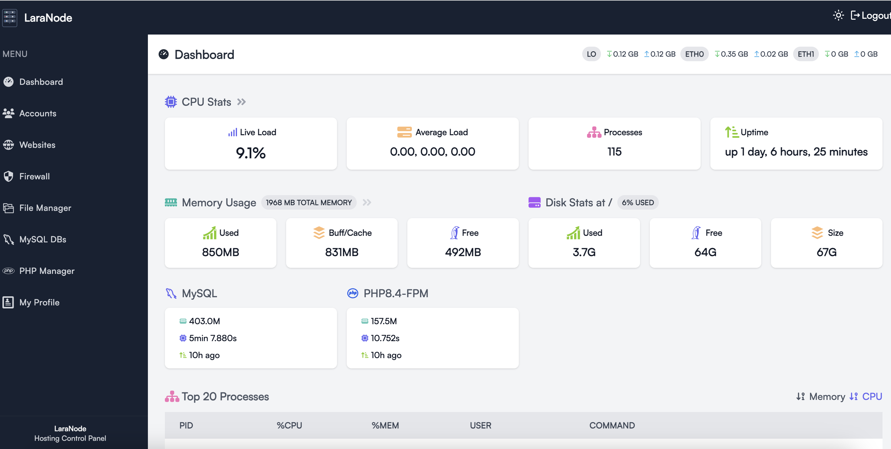 | 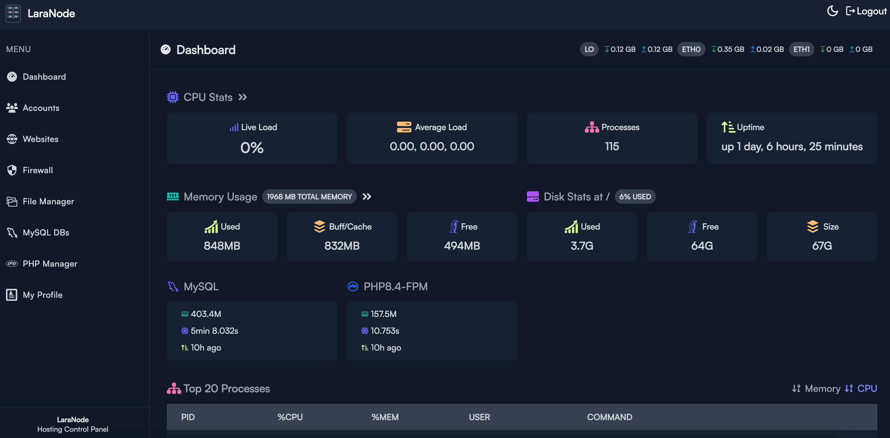 |
| 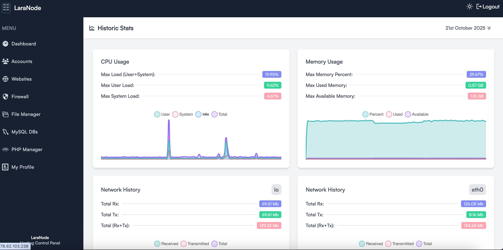 | 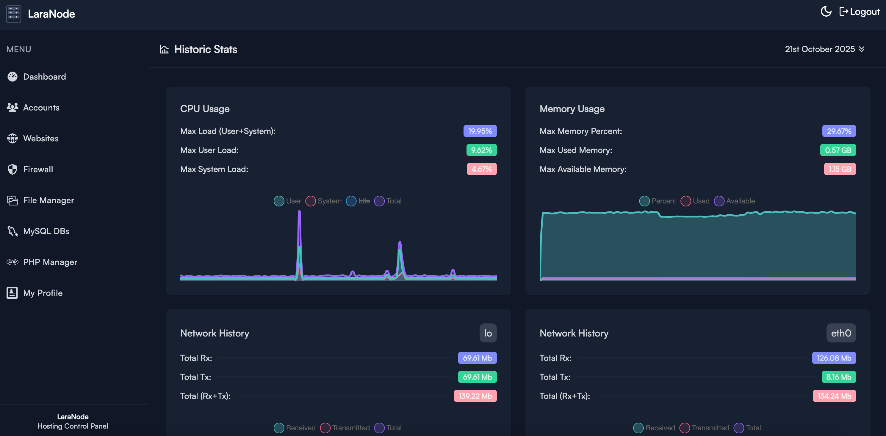 |
| 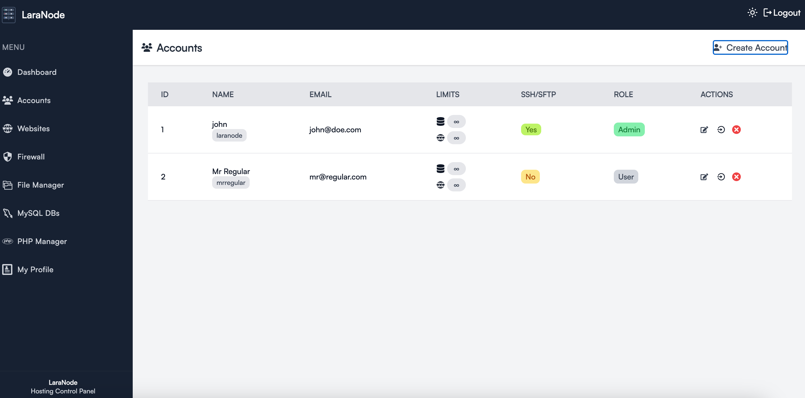 | 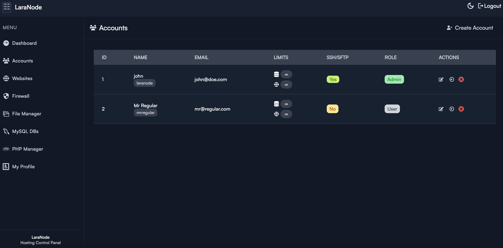 |
| 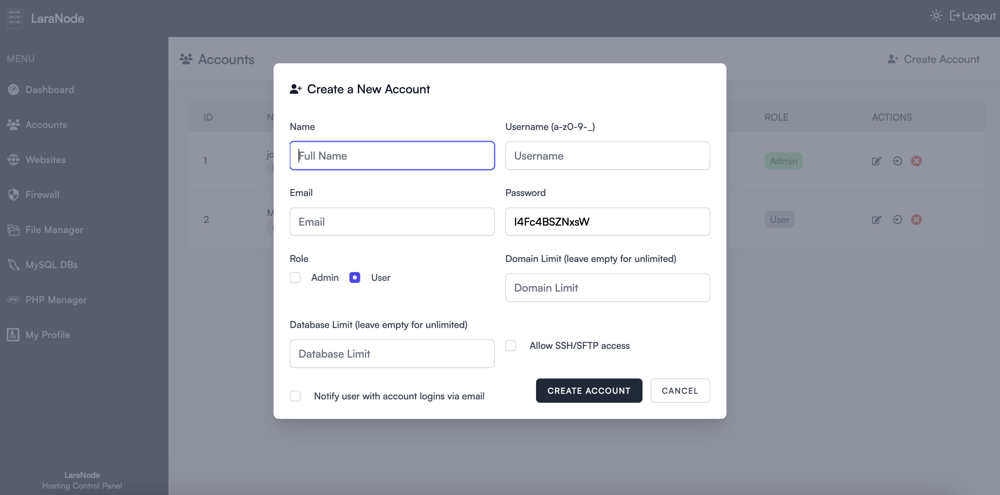 | 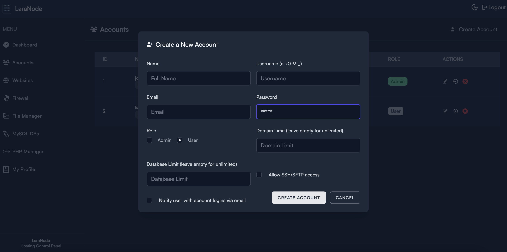 |
| 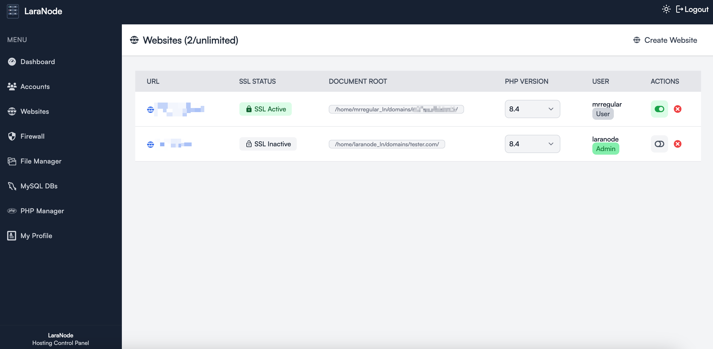 | 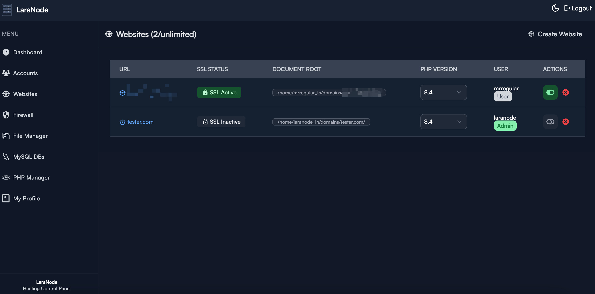 |
| 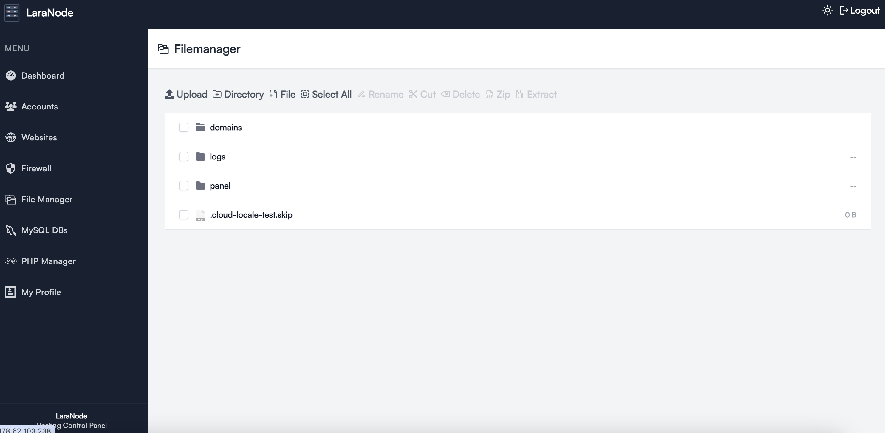 | 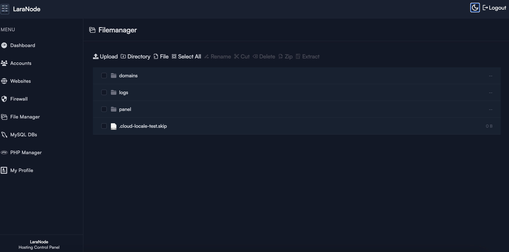 |
| 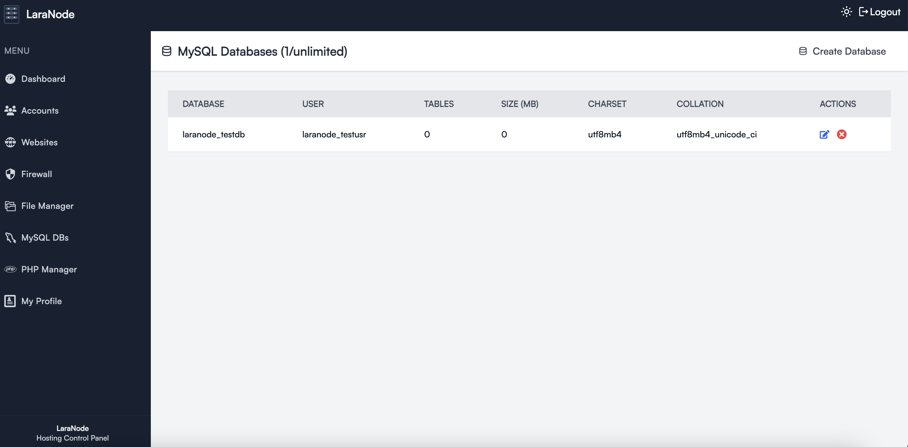 | 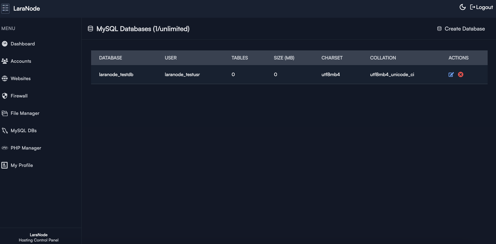 |
| 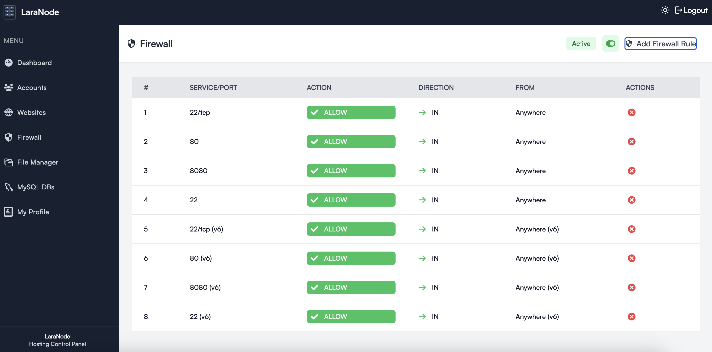 | 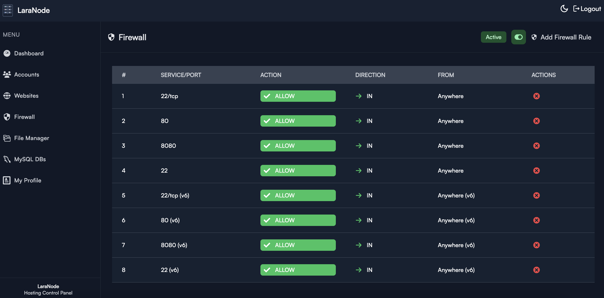 |

## Minimum Requirements


## 1-Click Deployment with DigitalOcean
[](https://marketplace.digitalocean.com/apps/laranode-panel?refcode=833110c66c2c&action=deploy)

## Contributing
Laranode is open-source and welcomes contributions! Feel free to submit issues, feature requests, or pull requests.

## License
Laranode is open-source and released under the [MIT license](https://opensource.org/licenses/MIT).
---

⭐ **Star this repo to support the project!**
